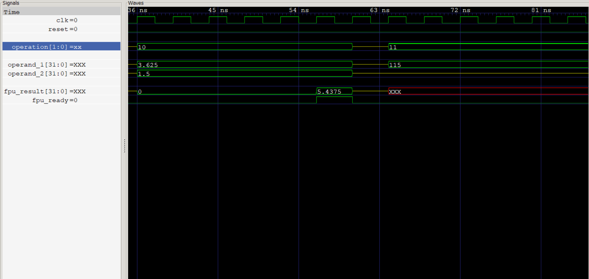
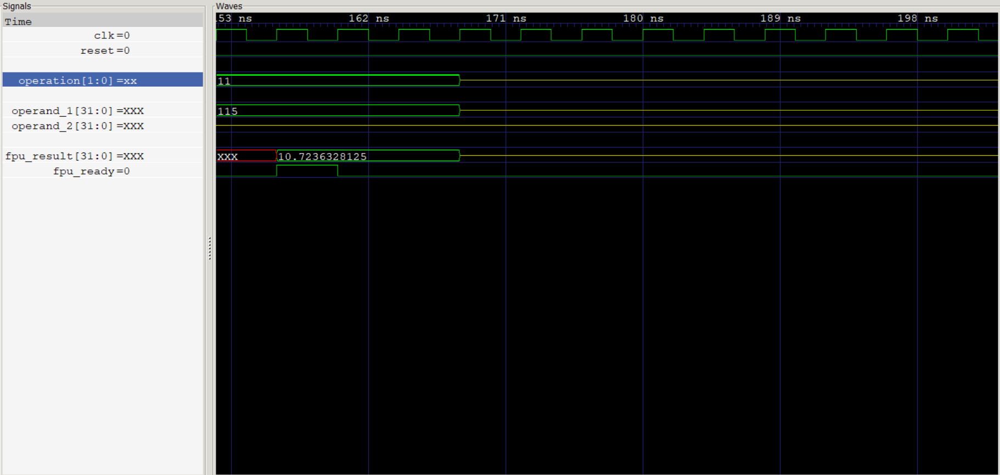
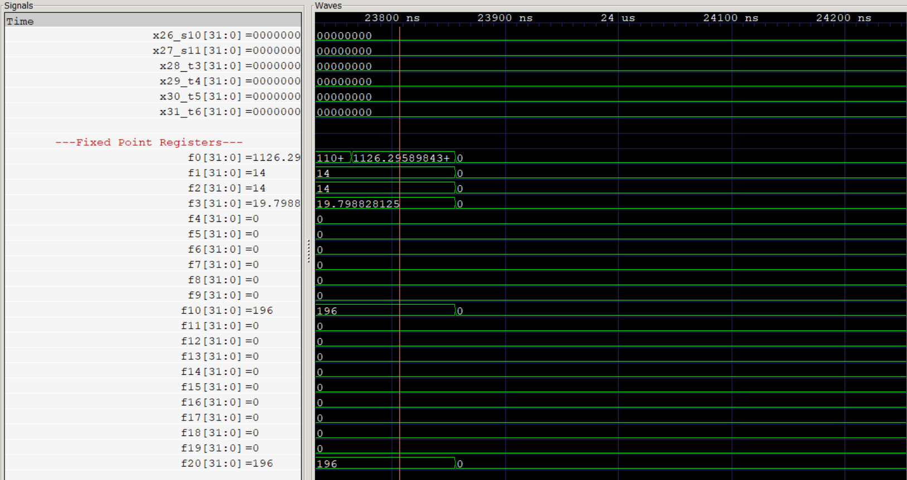

Computer Organization - Spring 2024
==============================================================
## Iran Univeristy of Science and Technology
## Final Project: Executing Verilog Code on LUMOS Processor

- Team Members: 
- Amirmohammad Salek - 400412265
- Mohammad Arabzadeh - 400412481
- Mahdi Ebrahimi Ravesh - 400411009
- Date: 07/03/2024

# Fixed Point Arithmetic Unit

## Overview

This Verilog project implements a Fixed Point Arithmetic Unit capable of performing various arithmetic operations on fixed-point numbers. The unit supports addition, subtraction, multiplication, and square root operations. It is designed with parameterizable word width and fractional bits to cater to different precision requirements.

## Features

- **Addition**: Performs fixed-point addition of two operands.
- **Subtraction**: Performs fixed-point subtraction of two operands.
- **Multiplication**: Performs fixed-point multiplication of two operands using a state machine.
- **Square Root**: Computes the square root of a fixed-point operand using an iterative method.

## Parameters

- `WIDTH`: Width of the fixed-point number, including integer and fractional bits. Default is 32 bits.
- `FBITS`: Number of fractional bits. Default is 10 bits.

## Module Description

### Fixed_Point_Unit

The `Fixed_Point_Unit` module is the top-level module that orchestrates the different arithmetic operations based on the input control signals.

#### Ports

- `clk`: Clock input.
- `reset`: Reset input.
- `operand_1`: First operand for the arithmetic operation.
- `operand_2`: Second operand for the arithmetic operation.
- `operation`: Control signal to select the operation (`00` for add, `01` for subtract, `10` for multiply, `11` for square root).
- `result`: Result of the arithmetic operation.
- `ready`: Signal indicating the operation is complete and the result is valid.

#### Operations

- **Addition (`FPU_ADD`)**: Adds `operand_1` and `operand_2`.
- **Subtraction (`FPU_SUB`)**: Subtracts `operand_2` from `operand_1`.
- **Multiplication (`FPU_MUL`)**: Multiplies `operand_1` and `operand_2` using an internal multiplier module.
- **Square Root (`FPU_SQRT`)**: Computes the square root of `operand_1` using an iterative method.

### Square Root Circuit

The square root circuit is implemented using a state machine to iteratively compute the square root of the input operand.

#### States

- `IDLE`: Initial state, waiting for the operation to start.
- `START`: Prepares for the calculation.
- `CALCULATE`: Iteratively computes the square root.
- `DONE`: Final state, indicating the calculation is complete.

#### Internal Signals

- `root`: Holds the computed square root.
- `root_ready`: Indicates when the square root calculation is complete.
- `sqrt_state`, `sqrt_next_state`: Current and next state of the square root state machine.
- `sqrt_start`, `sqrt_busy`: Control signals for starting and indicating the busy state of the square root calculation.
- `x`, `x_next`: Internal variables for the square root calculation.
- `q`, `q_next`: Quotient registers used in the calculation.
- `ac`, `ac_next`: Accumulator registers used in the calculation.
- `test_res`: Temporary result used in the computation.
- `iteration`: Counter for the number of iterations.

### Multiplier Circuit

The multiplier circuit is implemented using a state machine to handle the multiplication of the input operands.

#### States

- `0`: Initial state, preparing for the multiplication.
- `1`: Calculates the partial product of the lower halves of the operands.
- `2`: Calculates the partial product of the upper half of the first operand and the lower half of the second operand.
- `3`: Calculates the partial product of the lower half of the first operand and the upper half of the second operand.
- `4`: Calculates the partial product of the upper halves of the operands.
- `5`: Combines the partial products to produce the final result.

#### Internal Signals

- `product`: Holds the computed product.
- `product_ready`: Indicates when the multiplication is complete.
- `mul_state`: Current state of the multiplication state machine.
- `mul_op1`, `mul_op2`: Input operands for the multiplier.
- `mul_result`: Result of the multiplication of `mul_op1` and `mul_op2`.
- `P1`, `P2`, `P3`, `P4`: Partial products used in the multiplication.

### Multiplier Module

The `Multiplier` module performs 16-bit by 16-bit multiplication, producing a 32-bit product. It is instantiated within the `Fixed_Point_Unit` for performing the multiplication operation.

#### Ports

- `operand_1`: First operand for multiplication.
- `operand_2`: Second operand for multiplication.
- `product`: Product of the multiplication.

## Usage

To use the `Fixed_Point_Unit`, instantiate the module in your Verilog code, providing appropriate parameters for `WIDTH` and `FBITS`. Connect the inputs and outputs to your design as needed.

```verilog
Fixed_Point_Unit #(
    .WIDTH(32),
    .FBITS(10)
) fpu (
    .clk(clk),
    .reset(reset),
    .operand_1(operand_1),
    .operand_2(operand_2),
    .operation(operation),
    .result(result),
    .ready(ready)
);
```

Control the operation using the `operation` signal:
- `2'b00`: Addition
- `2'b01`: Subtraction
- `2'b10`: Multiplication
- `2'b11`: Square Root

The `ready` signal will be asserted when the operation is complete, and the result will be available on the `result` output.

## File Structure

- `Fixed_Point_Unit.v`: Contains the Verilog code for the Fixed Point Unit and the Multiplier module.
- `Defines.vh`: Header file containing the operation definitions (`FPU_ADD`, `FPU_SUB`, `FPU_MUL`, `FPU_SQRT`).


## Result Of The Calculation
- Mutiplier result


- SQRT result


- Final result
